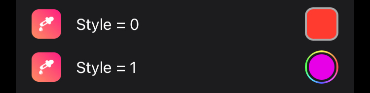

# LibGcUniversal
LibGcUniversal is a universal library for tweak development I made because I think it's annoying to add a new library for every little thing.

## Contents of LibGcUniversal
 - [GcColorPickerCell](#implementation-of-a-color-picker)
 - [GcImagePickerCell](#implementation-of-an-image-picker)
 - [Getting picker results from Sandboxed processes](#getting-picker-results-from-sandboxed-processes)
 - [GcTwitterCell](#implementation-of-a-twitter-cell)
 - [GcDuoTwitterCell](#implementation-of-a-duo-twitter-cell)
 - [GcSocialCell](#implementation-of-a-social-cell)
 - [Little helper methods](#using-the-helper-functions)
 - [Color utils](#using-the-color-utils)
 - [Image utils](#using-the-image-utils)
 - [Other](#other)

# Usage

## Installation in Theos

### Automatic installation (Recommended)

Run the `install.sh` script in this repository to automatically copy the necessary files.

### Manual installation

1. Download this repository
2. Copy the `libgcuniversal.tbd` into your `theos/lib` folder.
3. Copy the `libgcuniversalrootless.tbd` to `theos/lib/iphone/rootless` and rename it to `libgcuniversal.tbd`.
3. Put the `GcUniversal` folder into your `theos/include` folder.
4. Done!

## Project configuration
1. Add `TWEAKNAME_LIBRARIES = gcuniversal` to your makefiles (not needed if you only use one of the social cells for example)
2. Add `com.mrgcgamer.libgcuniversal` to the `Depends` in your `control` file
3. Done!

## Implementation of a color picker
PreferenceBundle plist (Root.plist e.g.)
```xml
<dict>
    <key>cell</key>
    <string>PSLinkCell</string>
    <key>cellClass</key>
    <string>GcColorPickerCell</string>
    <key>label</key>
    <string>Your Color Label</string>
    <key>defaults</key>
    <string>com.your.identifier</string>
    <key>key</key>
    <string>YourColor</string>
    <key>supportsAlpha</key>
    <true/>
    <key>safeOnDismiss</key>
    <true/>
    <key>fallback</key>
    <string>ffffffff</string>
    <key>style</key>
    <integer>1</integer>
</dict>
```
### supportsAlpha
The `supportsAlpha` property is optional and will default to `true` if nothing else has been specified.

### safeOnDismiss
The `safeOnDismiss` property is optional and will default to `true` if nothing else has been specified.
When `safeOnDismiss` is turned off, the user will have to press the `X` Button in the top right for the color to be saved, when this option is on, the color will be saved even if the color picker was dismissed via the swipe down gesture.

### fallback
The `fallback` property is optional and will default to a clear color if the fallback color hasn’t been set.

You may use any color hex code which conforms to one of the following color hex code notations:
 - `rgb` (`#FAE`)
 - `rgba` (`#BEEF` / `#FAE:0.69`)
 - `rrggbb` (`#DEADBE`)
 - `rrggbbaa` (`#DEADBEEF` / `#DEADBE:0.42`)

### style
The `style` property is optional and will default to `0`, which is the same style used by the imagepicker (rounded corners). <br/>
The `style` property can also be set to `1` which will result in the "stock" iOS style introduced in iOS 14 (the rainbow circle). NOTE: This option also works on iOS versions below iOS 14



### Retrieving a color (example)
Once this is implemented you can then get the chosen color from within your tweak. So an example of how to retrieve the color could look something like this:

```objc
#import <GcUniversal/GcColorPickerUtils.h>

UIColor *color = [GcColorPickerUtils colorFromDefaults:@"DEFAULTS" withKey:@"KEY"];
UIColor *colorWithFallback = [GcColorPickerUtils colorFromDefaults:@"DEFAULTS" withKey:@"KEY" fallback:@"ffffffff"];
```
Fallback values have to condone to one of the above-mentioned notations.<br>
For other helpful methods (color - HEX conversion), take a look at [GcColorPickerUtils.h](GcUniversal/GcColorPickerUtils.h)

## Implementation of an image picker
PreferenceBundle plist (Root.plist e.g.)
```xml
<dict>
    <key>cell</key>
    <string>PSLinkCell</string>
    <key>cellClass</key>
    <string>GcImagePickerCell</string>
    <key>label</key>
    <string>Your Image Label</string>
    <key>defaults</key>
    <string>com.your.identifier</string>
    <key>key</key>
    <string>YourImage</string>
    <key>usesPhotos</key>
    <true/>
    <key>usesVideos</key>
    <false/>
    <key>videoQuality</key>
    <integer>1</integer>
</dict>
```
### usesPhotos
The `usesPhotos` property is optional and will default to `true`.
### usesVideos
The `usesVideo` property is optional and will default to `false`.
### videoQuality
The `videoQuality` property is optional. It impacts both media quality and storage space usage.<br/>
The default value of `videoQuality` is `1`.<br/>
Possible `videoQuality` values are as follows:
- `0` = high quality
- `1` = medium quality
- `2` = low quality

### Retrieving an image (example)
```objc
#import <GcUniversal/GcImagePickerUtils.h>

UIImage *scaledThumbnail = [GcImagePickerUtils thumbnailFromDefaults:@"DEFAULTS" withKey:@"KEY" maxSize:400 scale:2]; // scaled to maxSize, lower memory usage
UIImage *thumbnail = [GcImagePickerUtils thumbnailFromDefaults:@"DEFAULTS" withKey:@"KEY"]; // lower res, lower memory usage
UIImage *img = [GcImagePickerUtils imageFromDefaults:@"DEFAULTS" withKey:@"KEY"]; // full size, high memory usage
```
NOTE:<br>
It is recommended that you make yourself familiar with the [GcImagePickerUtils.h](GcUniversal/GcImagePickerUtils.h) header, to see the available methods.<br>
The `thumbnailFromDefaults:` methods should be used in most cases as the resulting images are scaled to a max size, based on the decives `scale` and `screenSize`.
```objc
+ (UIImage *)thumbnailFromDefaults:(NSString *)defaults withKey:(NSString *)key ;
```
<br/>If you want to get the images data instead of the image you can use:
```objc
NSData *data = [GcImagePickerUtils dataFromDefaults:@"DEFAULTS" withKey:@"KEY"];
```

### Retrieving a video (example)
If you decided to let the user pick a video, you can retrieve an `NSURL` leading to it something like this:
```objc
#import <GcUniversal/GcImagePickerUtils.h>

NSURL *videoURL = [GcImagePickerUtils videoURLFromDefaults:@"DEFAULTS" withKey:@"KEY"];

if (videoURL) { // this check is to prevent a crash in case the user didn't select any media
    // do something with the videoURL
}
```
### Getting the media type
In case you give the user the ability to choose a video or an image, you can easily check which one they went for, by doing something like this:
```objc
#import <GcUniversal/GcImagePickerUtils.h>

BOOL isVideo = [GcImagePickerUtils isVideoInDefaults:@"DEFAULTS" withKey:@"KEY"];

if (isVideo) {
    // do video stuff
} else {
    // do photo stuff
}
```
It is also possible to check if the user selected an image like this:
```objc
BOOL isPhoto = [GcImagePickerUtils isImageInDefaults:@"DEFAULTS" withKey:@"KEY"];
```
If you prefer that (though it doesn't make any difference which method you use).

### Programmatically setting the image selection
In case you want to store some image for later reuse, you can do so using:
```objc
+ (BOOL)setImage:(UIImage *)image forDefaults:(NSString *)defaults withKey:(NSString *)key png:(BOOL)png ;
```
Example:
```objc
#import <GcUniversal/GcImagePickerUtils.h>

BOOL success = [GcImagePickerUtils setImage:img forDefaults:@"com.mrgcgamer.test" withKey:@"SomeKey"];

if (success)
    NSLog(@"Image saved successfully");
```

## Getting picker results from Sandboxed processes
I would suggest using Cephei if you are working in a sandboxed app, as it makes preferences mush easier and handles XPC stuff for the prefs.<br/>
For images, you would probably need to set up some form of IPC, and for a video, I am not quite sure if that is possible at all, without moving it to the apps documents directory due to the fact, that videos are most likely used in an AVPlayer which uses a URL, but the AVPlayer is also going to be restricted by the sandbox and therefore not able to access the directory, where the video will be copied to, by the library, but for colors you can just use Cephei like this:
```objc
HBPreferences *prefs = [[HBPreferences alloc] initWithIdentifier:@"DEFAULTS"];

NSString *colorHEX = [prefs objectForKey:@"KEY"];
UIColor *yourColor = [GcColorPickerUtils colorWithHex:colorHEX];
```
## Implementation of a Twitter cell
PreferenceBundle plist (Root.plist e.g.)
```xml
    <dict>
        <key>cell</key>
        <string>PSButtonCell</string>
        <key>cellClass</key>
        <string>GcTwitterCell</string>
        <key>accountLabel</key>
        <string>LabelForTheAccount</string>
        <key>account</key>
        <string>TwitterTagOfAccount</string>
        <key>URL</key>
        <string>URLToAnotherFancyImage</string>
    </dict>
```
It is recommended to use a picture with a resolution of around `200x200`.
### URL
`URL` is an optional value, for the link to an image to display.
### Local profile picture
If don't want to use the URL, you will also need to include the profile picture of the account in the `Resources` folder of your preferences.
The picture will have to have the same name as the Twitter tag of the provided account and be stored as a `.png` file.

## Implementation of a duo Twitter cell
PreferenceBundle plist (Root.plist e.g.)
```xml
    <dict>
        <key>cellClass</key>
        <string>GcDuoTwitterCell</string>
        <key>firstLabel</key>
        <string>LabelForTheFirstAccount</string>
        <key>firstAccount</key>
        <string>TwitterTagOfFirstAccount</string>
        <key>firstURL</key>
        <string>URLToSomeFancyImage</string>
        <key>secondLabel</key>
        <string>LabelForTheSecondAccount</string>
        <key>secondAccount</key>
        <string>TwitterTagOfSecondAccount</string>
        <key>secondURL</key>
        <string>URLToAnotherFancyImage</string>
    </dict>
```
It is recommended to use a picture with a resolution of around `200x200`.
### URLs
`firstURL` and `secondURL` are optional values, which can be set, to specify a URL to the images for each account somewhere online.
If you use the URLs, make sure they link to the images directly. It is also possible to have only one image loaded using the URL and the other one using local files.
### Local profile pictures
If don't want to use the URLs, you will also need to include the profile pictures of the two accounts in the `Resources` folder of your preferences.
The pictures will have to have the same name as the Twitter tag of the corresponding account and be stored as `.png` files.

## Implementation of a Social Cell
PreferenceBundle plist (Root.plist e.g.)
```xml
    <dict>
        <key>cell</key>
        <string>PSButtonCell</string>
        <key>cellClass</key>
        <string>GcSocialCell</string>
        <key>userName</key>
        <string>AccountLabel</string>
        <key>subtitle</key>
        <string>someFancySubtitle</string>
        <key>accessoryType</key>
        <integer>0</integer>
        <key>accessoryURL</key>
        <string>URLToAnAccessoryImage</string>
        <key>pfpURL</key>
        <string>URLToSomePFP</string>
        <key>URL</key>
        <string>URLToSomewhere</string>
    </dict>
```
### userName
`userName` is a required value and will be the username displayed on the cell.
### subtitle
`subtitle` is an optional value and will be displayed below the `userName` if specified.
If it hasn't been specified the `userName` will be horizontally centred on the cell. In case you don't want the username to be centred but also don't want to specify a subtitle, you can specify a subtitle only containing whitespace characters.
### accessoryType
`accessoryType` is an optional value, which can be specified in order to display an accessory image (the little image on the right-hand side).
The default value of `accessoryType` is `0`.
Possible `accessoryType` values are as follows:
- `0` = none
- `1` = Github
- `2` = Reddit
- `3` = Custom
### accessoryURL
This property is optional and only applies if you chose to set the `accessoryType` to `3` / custom.
Here you can specify the URL to an image will which be displayed as the accessory image
### Local accessory image
If you want to use a local image as the accessory icon, you will have to put it in the 'Resources' folder of your preference bundle and it will have to have the name:`userName.png` where `userName` is the same you specified earlier for display.
### Custom accessory image note
It is recommended to provide an image with no clear border on any side, to avoid an unexpectedly small or shifted icon.
### URL
`URL` is required and is the URL the user will be lead to, once they tapped the cell.

## Using the helper functions
First of all, you will need to import HelperFunction.h as follows:
```objc
#import <GcUniversal/HelperFunctions.h>
```
The [HelperFunctions.h](GcUniversal/HelperFunctions.h) file includes this interface (more stuff in the file):
```objc
@interface UIView (extension)
-(void)anchorTop:(nullable NSLayoutAnchor <NSLayoutYAxisAnchor *> *)top
         leading:(nullable NSLayoutAnchor <NSLayoutXAxisAnchor *> *)leading
          bottom:(nullable NSLayoutAnchor <NSLayoutYAxisAnchor *> *)bottom
        trailing:(nullable NSLayoutAnchor <NSLayoutXAxisAnchor *> *)trailing
         padding:(UIEdgeInsets)insets
            size:(CGSize)size ;

-(void)anchorCenterX:(nullable NSLayoutAnchor <NSLayoutXAxisAnchor *> *)centerX
             centerY:(nullable NSLayoutAnchor <NSLayoutYAxisAnchor *> *)centerY
                size:(CGSize)size ;

-(void)anchorEqualsToView:(UIView *)view padding:(UIEdgeInsets)insets ;
@end

void logToFile(NSString *path, NSString *log);
```
### Constraint helpers usage
Therefor you can use the HelperFunctions like this:
```objc
UIView *view = [UIView new];
[someOtherView addSubview:view];

[view anchorTop:someOtherView.topAnchor leading:someOtherView.leadingAnchor bottom:nil trailing:nil padding:UIEdgeInsetsMake(32,15,0,0) size:CGSizeMake(64,64)];
```
Now, this would constrain the `topAnchor` of `view` to the `topAnchor` of `someOtherView` with padding of `32`,
also, this would constrain the `leadingAnchor` of `view` to the `leadingAnchor` of `someOtherView` with padding of `15`,
furthermore, this would constrain the `widthAnchor` and `heightAnchor` of `view` to `64` each.

If you are looking for a better explanation of this function, I recommend watching [this](https://www.youtube.com/watch?v=iqpAP7s3b-8&t=840s) video, as it's also where I got the function from, which I tried to convert to Obj-C.

### logToFile
```objc
void logToFile(NSString *path, NSString *log);
```
This is a simple convenience function, which writes the given log to the end of the of the file at the provided path. (If the file doesn't exist, it will be created)

## Using the color utils
Don't forget to import the `GcColorUtils.h`.
```objc
#import <GcUniversal/GcColorUtils.h>
```
The interface in `GcColorUtils.h` looks as follows:
```objc
typedef NS_ENUM(NSUInteger, ColorComponent) {
   kColorRed,
   kColorGreen,
   kColorBlue,
   kColorHue,
   kColorSaturation,
   kColorBrightness,
   kColorAlpha
};

@interface UIColor (colorUtils)
+ (UIColor *)closestColorFromArray:(NSArray *)colors toColor:(UIColor *)color ;
- (CGFloat)getColorComponent:(ColorComponent)component ;
- (CGFloat)rgbValue;
- (BOOL)isGrayscale;
- (BOOL)isNearGrayscale;
- (BOOL)isDarkColor;
- (BOOL)isLightColor;
@end
```
All the functions should be relatively self-explanatory I think, but I will explain a few of them anyways.
The `closestColorFromArray: toColor: ;` function returns the color from the input array, which is the closest to the input color.
The `rgbValue` function returns a float between 0 and 3. This float is calculated by adding the `r`, `g` and `b` values of the color together.

## Using the image utils
Don't forget to import the `GcImageUtils.h`.
```objc
#import <GcUniversal/GcImageUtils.h>
```
The interface in `GcImageUtils.h` looks as follows:
```objc
@interface UIImage (imageUtils)
+ (UIImage *)stockImgForBundleID:(NSString *)arg1 ;
+ (UIImage *)thumbnailForImage:(UIImage *)image withMaxSize:(CGFloat)maxSize scale:(CGFloat)scale ;
- (UIColor *)averageColor;
- (NSArray <UIColor *> *)dominantColors;
@end
```
### stockImgForBundleID
This method will give you the stock (unthemed) icon for an app / service.

### thumbnailForMaxSize
This method returns a downscaled version of the provided image.
It downscaled to the `maxSize` provided eg: with `maxSize = 400` and an image of `1920x1080` it will be resized to `400x225`.<br>
Why is that useful?<br>
Downsampling the image manually instead of letting UIKit handle this at display time drastically reduces the memory footprint of the image in memory, thus it is recommended to use this method whenever you use "global" images of a substantial size for extended periods of time.

### averageColor
Returns the average / mean color of an image.

### dominantColors
Do note that this function will return an array of colors with an unspecified count, so you will have to check for the array count manually and you might have to specify different behaviour within your project depending on the number of colors returned.

The rest of these functions should be self-explanatory though, but if you do have a question, just ask me on Twitter or something.

## Other
If you want to ask me anything about my library or if you happen to find a typo feel free to contact me on [Twitter](https://twitter.com/messages/compose?recipient_id=860938938910986244) or ping me on a discord server, if you find me (no friend-requests or message-requests).
